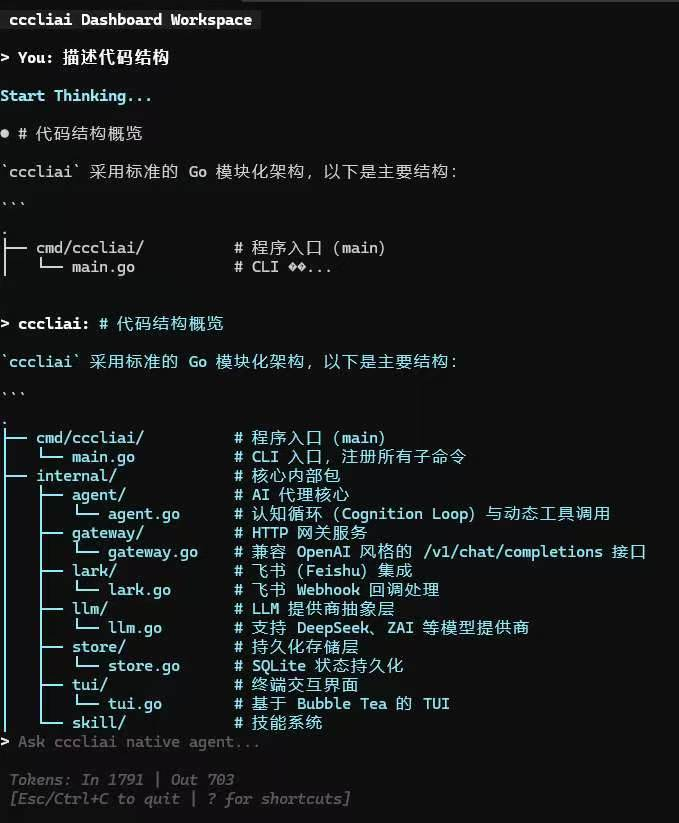
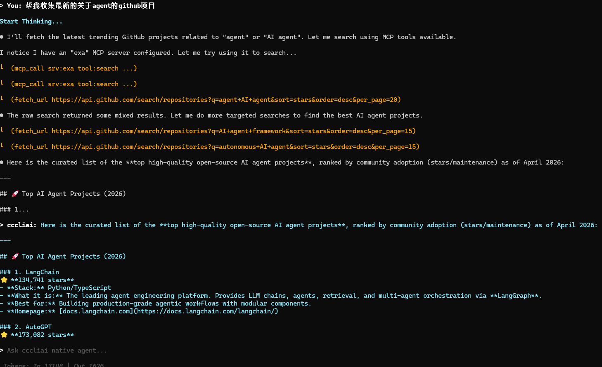
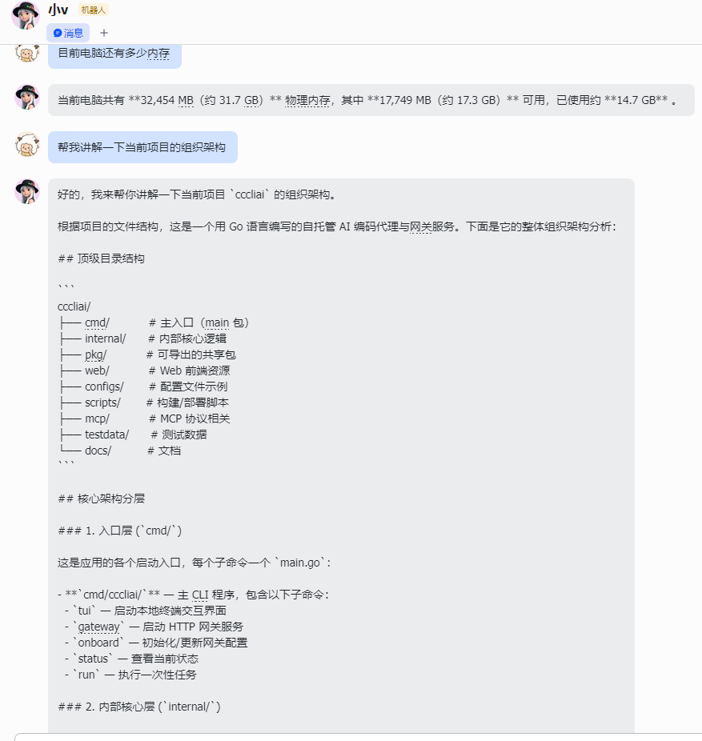

# cccliai（Go 版本）

`cccliai` 是一个用 Go 实现的自托管 AI 编码代理与网关服务。
它支持本地 TUI 交互、HTTP 网关接口，以及飞书（Feishu）Webhook 接入。

## 项目特性

- 自主认知循环（Cognition Loop）与动态工具调用
- 本地优先，状态持久化到 SQLite
- 基于 Bubble Tea 的终端交互界面（TUI）
- 网关模式 + 飞书回调处理
- 可扩展技能系统（`~/.cccliai/skills/`）
- 兼容 OpenAI 风格的聊天接口（`/v1/chat/completions`）

## 环境要求

- Go `1.25.5+`（以 `go.mod` 为准）
- 至少配置一个模型提供商密钥：
  - `DEEPSEEK_API_KEY`（DeepSeek）
  - `ZAI_API_KEY`（ZAI）
  - 或 `PROVIDER_API_KEY` + `PROVIDER_TYPE`

## 快速开始（本地 TUI）

1. 安装依赖：

```bash
go mod tidy
```

2. 创建环境变量文件：

```bash
cp .env.example .env
```

3. 配置 `.env`（最小示例）：

```bash
PROVIDER_TYPE=deepseek
PROVIDER_MODEL=deepseek-chat
DEEPSEEK_API_KEY=sk-xxxx
```

4. 初始化网关配置：

```bash
go run ./cmd/cccliai onboard
```

5. 启动本地 TUI：

```bash
go run ./cmd/cccliai tui
```

6. 查看状态：

```bash
go run ./cmd/cccliai status
```

## CLI 命令

查看完整命令：

```bash
go run ./cmd/cccliai --help
```

常用命令：

- `onboard`：初始化/更新网关提供商、模型、API Key
- `tui`：启动本地终端界面
- `gateway`：启动 HTTP 网关服务
- `channel bind-feishu`：绑定飞书应用凭据
- `status`：查看当前网关状态
- `logs`：实时查看系统日志

示例：

```bash
# 指定 provider/model/key
go run ./cmd/cccliai onboard --provider deepseek --model deepseek-chat --api-key "sk-xxxx"

# 以默认端口 42617 启动网关
go run ./cmd/cccliai gateway -p 42617

# 绑定飞书
go run ./cmd/cccliai channel bind-feishu --app-id "cli_xxx" --app-secret "xxx" --verification-token "xxx"
```

## 环境变量说明

程序会自动加载当前目录下的 `.env` 和 `.env.local`。

Provider 相关变量：

- `PROVIDER_TYPE`：`deepseek` 或 `zai`
- `PROVIDER_MODEL`：选中 provider 的模型名覆盖
- `DEEPSEEK_API_KEY`：DeepSeek 密钥
- `ZAI_API_KEY`：ZAI 密钥
- `PROVIDER_API_KEY`：共享密钥（仅在 `PROVIDER_TYPE` 匹配时使用）

## Gateway HTTP 接口

默认端口：`42617`

- `GET /health`
- `GET /status`
- `GET /api/gateways`
- `POST /v1/chat/completions`
- `POST /webhook/feishu`

调用示例：

```bash
curl -X POST http://127.0.0.1:42617/v1/chat/completions \
  -H "Content-Type: application/json" \
  -d '{
    "model": "deepseek-chat",
    "messages": [{"role": "user", "content": "请用三条总结这个仓库"}]
  }'
```

## 飞书接入

1. 先绑定飞书应用：

```bash
go run ./cmd/cccliai channel bind-feishu --app-id "cli_xxx" --app-secret "xxx" --verification-token "xxx"
```

2. 在飞书开发者后台配置回调地址：

```text
http://<your-host>:42617/webhook/feishu
```

3. 当前实现只支持明文（plaintext）回调体。

## 技能系统（Skills）

技能目录：`~/.cccliai/skills/`

支持两类技能：

1. 指令型技能（`.md` + frontmatter）
2. 可执行技能（`skills.json` + shell/可执行命令）

示例（指令型）：

```markdown
---
name: frontend-design
description: 生成有辨识度的前端页面设计建议
---
## 原则
- 重视排版层次
- 避免模板化布局
```

## 默认数据目录

默认保存在 `~/.cccliai/`：

- `config.json`：运行配置
- `cccliai.db`：SQLite 数据库
- `system.log`：全局日志
- `Persona.md`：身份与命令限制
- `skills/`：技能文件目录

## 安全说明

可通过 `Persona.md` 中的 `exclude_cmd` 限制高风险命令。

示例：

```markdown
tools: read_file, list_files, apply_patch, exec
exclude_cmd: rm, shutdown, format
```

## 常见问题

- 提示 `No gateway found. Run 'cccliai onboard' first.`
  - 先执行：`go run ./cmd/cccliai onboard`

- 提示找不到 provider API key
  - 检查 `.env`，确认 `PROVIDER_TYPE` 与密钥配置一致

- Windows 下 `cccliai logs` 无法使用 `tail -f`
  - 可改用：`Get-Content "$HOME/.cccliai/system.log" -Wait`

- 飞书回调报加密体不支持
  - 请将飞书事件回调 body 模式改为明文

## 截图





# cccliai
